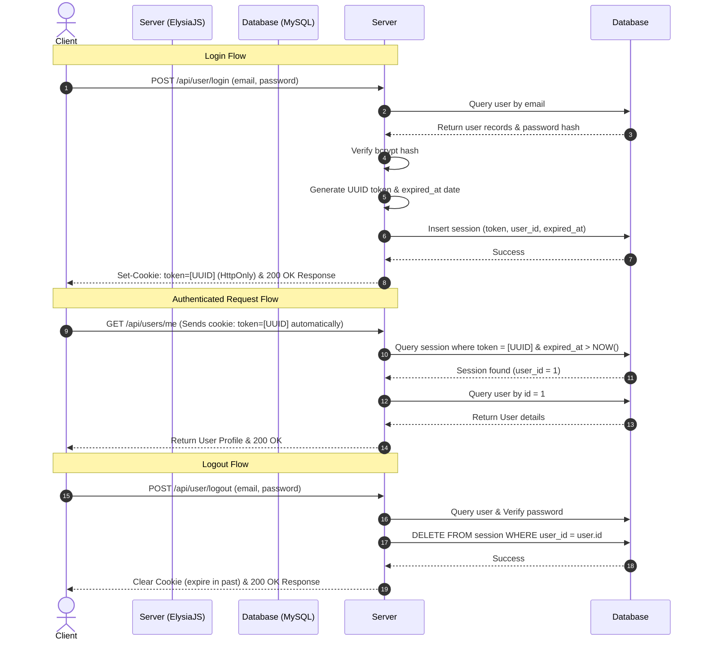

# Authentication Documentation (Session-Based Auth)

This application uses a strict **Session-Based Authentication** mechanism. We explicitly avoid stateless Token-Based auth (like JWTs stored in browser localStorage or sessionStorage) in favor of secure, server-managed sessions stored in the database and matched against secure `HttpOnly` client-side cookies.

---

## 🔒 Session-Based vs. Token-Based Auth

| Feature | Session-Based Auth (Our Choice) | Token-Based Auth (Stateless JWT) |
| :--- | :--- | :--- |
| **Session State** | Stored on the Server (Database `session` table) | Stored on the Client (Encrypted in JWT payload) |
| **Client Storage** | Secure, browser-protected `HttpOnly` Cookie | Usually `localStorage` or `sessionStorage` |
| **XSS Vulnerability** | **Extremely Low** (JavaScript cannot access HttpOnly cookies) | **High** (If JavaScript is compromised, tokens are stolen) |
| **Revocation** | **Instant** (Simply delete the session from the database) | **Difficult** (JWT remains valid until its natural expiration) |
| **Cookie Flags** | `HttpOnly`, `Secure`, `SameSite=Strict`, `Path=/` | N/A or standard client-side header inclusion |

---

## ⚙️ Core Components

### 1. The `session` Table
Rather than trusting a client-signed token blindly, the server holds a registry of active, valid sessions in the `session` table. Each session contains:
- `token`: A highly-secure, cryptographically random UUID.
- `user_id`: The ID of the authenticated user.
- `expired_at`: A timestamp after which the session is no longer recognized as valid.

### 2. Secure Cookie Configuration
When a user logs in, the session token is sent to the browser via the `Set-Cookie` header with these strict security properties:
- **`HttpOnly`**: The browser blocks JavaScript from accessing the cookie (`document.cookie` is empty). This completely eliminates the threat of token theft via Cross-Site Scripting (XSS) attacks.
- **`Secure`**: The browser only sends the cookie over encrypted HTTPS connections (should be disabled for local development if not using local SSL).
- **`SameSite=Strict`**: The browser never sends the cookie on cross-site requests. This mitigates Cross-Site Request Forgery (CSRF) attacks.
- **`Path=/`**: The cookie is valid for all routes on the domain.

---

## 🔄 Authentication Flows

### 1. Login Flow (`POST /api/user/login`)
1. User submits `email` and `password` (or attempts Gmail login).
2. Server verifies the identity of the user.
3. Server generates a session `token` (UUID) and sets the `expired_at` timestamp.
4. Server inserts the record into the `session` table.
5. Server attaches the `token` in an `HttpOnly` cookie.
6. Server sends the user details back in the response body.

### 2. Logout Flow (`POST /api/user/logout`)
1. User sends the credentials `email` and `password` in the body.
2. Server validates the credentials.
3. Server deletes the session record from the database `session` table.
4. Server commands the browser to clear the `token` cookie.
5. Server sends a successful logout response.
